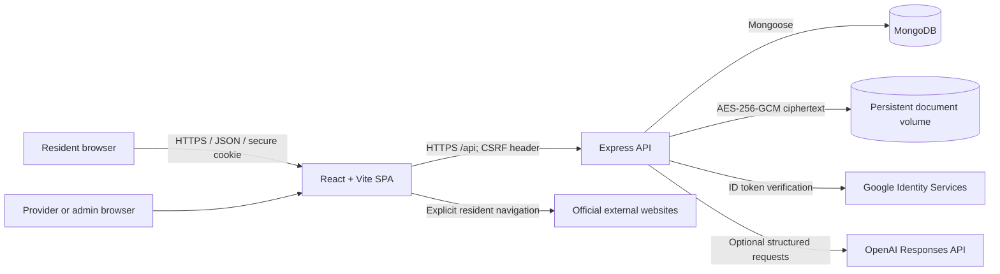

# Architecture

## System context

Official websites are handoffs, not API integrations. Healthcare, home-service, and
roadside provider records are demonstration data. The integration register is the
source of truth for those claims.

## Runtime responsibilities

| Layer | Responsibility |
| --- | --- |
| React SPA | Accessible journeys, local form state, explicit consent/confirmation, CSRF-aware API client, role-aware navigation |
| Express routing/middleware | CORS allowlist, Helmet, body limits, payload sanitization, session lookup, CSRF checks, rate limiting, validation and authorization |
| Controllers | Translate validated requests to service operations and redact responses |
| Domain services | Recommendation, scheduling, state transitions, AI boundaries, PDF creation, reminders, status connectors, encryption and analytics privacy |
| Mongoose models | Ownership references, indexes, unique booking constraints, expiry and allowed persisted state |
| MongoDB | Users, sessions, plans, bookings, requests, reminders, trackers and metadata |
| Document volume | Encrypted bytes only; metadata and ownership remain in MongoDB |

## Trust boundaries

1. The browser is untrusted. Every mutation is revalidated and authorized by the API.
2. Authentication uses random opaque cookies; MongoDB stores token hashes. Mutations
   from authenticated sessions require the matching CSRF token.
3. Provider/admin access is role-gated and operational responses are redacted.
4. OpenAI is optional. Reviewed catalogues, schemas, citations and deterministic
   fallbacks constrain generation; an AI response cannot submit or mutate a service
   record without an explicit approved action.
5. Google ID tokens are verified server-side against the configured audience and
   nonce before a local session is created.
6. Official links cross out of Vidhya Vedha. Their content, availability, submission
   and status are controlled by the responsible authority.

## Key flows

### Resident companion

`intake → validated assessment → deterministic candidates → optional structured AI
refinement → owner-scoped history → readiness → reviewed draft/PDF → consented
reminder → internal status connector or handoff`

### Operational booking/dispatch

`validated request → ownership/role check → uniqueness or transition guard → MongoDB
write → redacted resident/provider view → notification`

## Scaling constraints

- The reminder worker currently runs in the API process; production needs a single
  elected worker or external queue to prevent duplicate work.
- The encrypted vault uses a local persistent volume; horizontal API replicas require
  shared encrypted object storage and a managed key service.
- Rate limiting is process-local unless a shared store is configured.
- Seed-on-start provider data is appropriate for demos, not partner onboarding.
